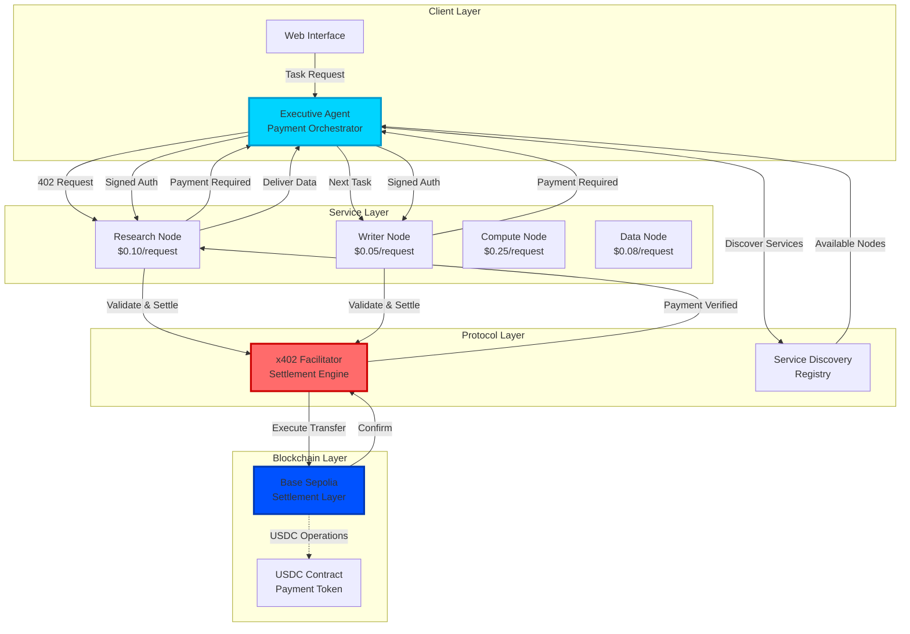
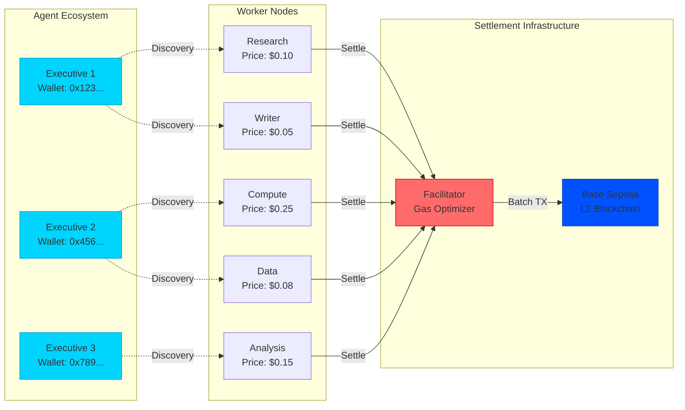
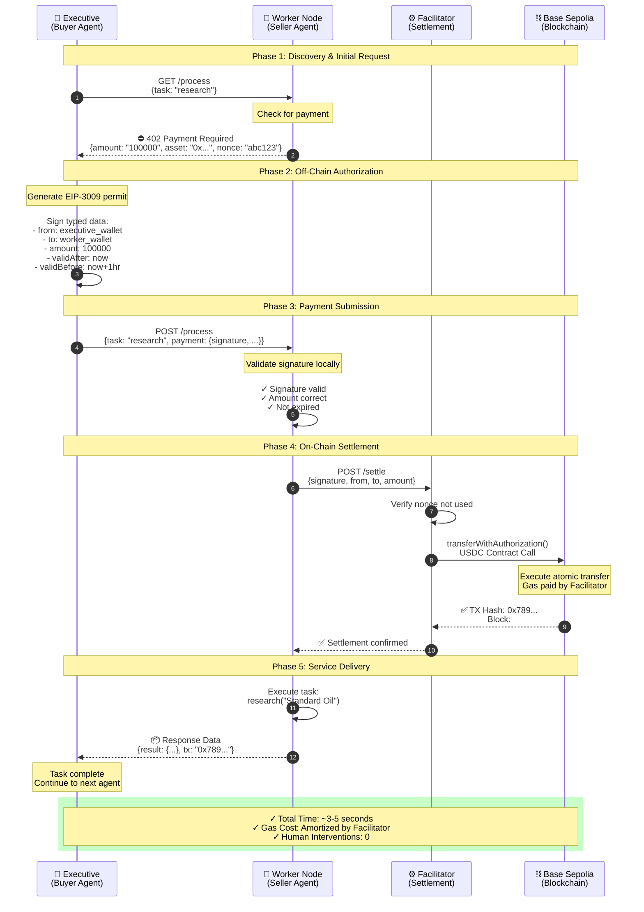
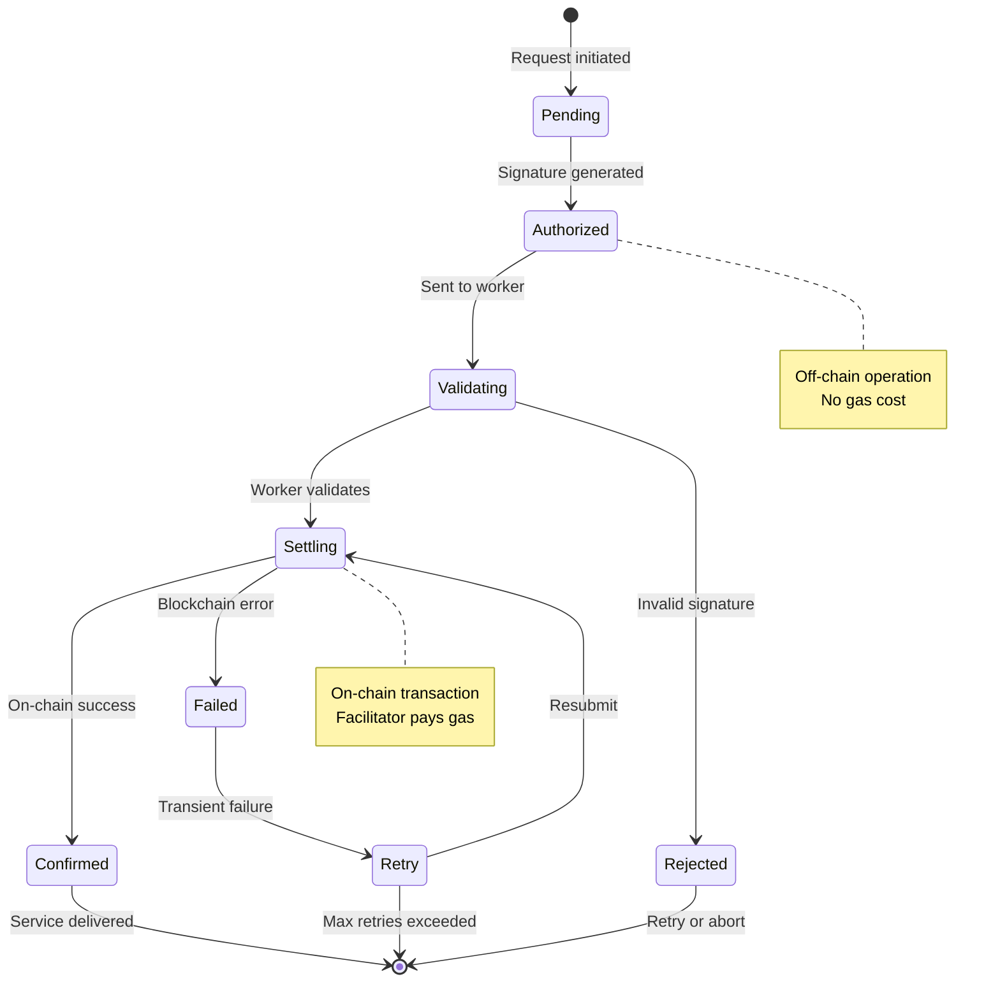

<div align="center">
  <h1>⚡️ Nexus Protocol</h1>
  <h3>The Operating System for Agentic Commerce</h3>
  
  <p>
    <strong>Autonomous Marketplace</strong> • <strong>x402 Native</strong> • <strong>Zero-Friction Settlement</strong>
  </p>


  
  
  
  
</div>

---
## 🌐 Overview

Nexus Protocol is an operating system for agentic commerce, enabling autonomous AI agents to discover, negotiate, and transact with each other without human intervention. Built on the x402 V2 protocol, Nexus transforms the internet into a machine economy where agents act as independent economic actors.

### Key Features

- **🤖 Autonomous Agent Economy**: Agents possess wallets and make independent economic decisions
- **💰 Micro-payment Infrastructure**: Sub-cent transactions with millisecond settlement times
- **🔒 Cryptographically Secure**: EIP-3009 authorization signatures for trustless payments
- **⚡️ Zero-Friction Commerce**: Automatic price discovery and negotiation
- **🌍 Decentralized Marketplace**: Open network for agent-to-agent services
- **📊 Real-time Analytics**: Complete transaction visibility and monitoring

---

## 🎯 Problem Statement

### Current State: The AI Agent Economic Paralysis

Modern AI agents are cognitively powerful but economically constrained:

```
┌─────────────────────────────────────────────────────────┐
│  Current AI Agent Limitations                           │
├─────────────────────────────────────────────────────────┤
│  ❌ Cannot purchase specialized datasets ($0.05)        │
│  ❌ Cannot hire premium compute resources ($0.10)       │
│  ❌ Cannot compensate other agents for services         │
│  ❌ Require human credit cards for every transaction    │
│  ❌ Cannot participate in open marketplaces             │
│  ❌ No autonomous economic decision-making              │
└─────────────────────────────────────────────────────────┘
```

**The Bottleneck**: Every AI agent advancement is throttled by payment infrastructure designed for humans, not machines.

---

## ✨ Solution

Nexus Protocol introduces **Agentic Commerce** - a complete operating system where AI agents function as autonomous economic actors.

### Core Innovation: The x402 Payment Protocol

```
Traditional API                    Nexus Protocol
─────────────────                  ───────────────
API Key Required      ──────►      Wallet Required
Monthly Subscription  ──────►      Pay-per-Request
Human Authorization   ──────►      Agent Authorization
Static Pricing        ──────►      Dynamic Markets
Centralized Access    ──────►      Decentralized Discovery
```

### Economic Transformation

| Metric | Before Nexus | With Nexus |
|--------|--------------|------------|
| **Transaction Size** | $5+ minimum | $0.01+ micro-payments |
| **Settlement Time** | 2-3 business days | <500ms |
| **Agent Autonomy** | 0% (human required) | 100% autonomous |
| **Market Access** | Centralized APIs | Open marketplace |
| **Cost Structure** | Fixed subscriptions | Usage-based pricing |

---

## 📽 Live Demo

### Demo Flow: Autonomous Research Task

Watch Nexus orchestrate a multi-agent workflow with zero human intervention:

```
User Request: "Research Standard Oil history and create a PDF report"
           ↓
    [Nexus Executive]
           ↓
    Discovery Phase → Scans network for capable agents
           ↓
    ┌──────────────────────────────────────────┐
    │  🔍 Research Node Found                  │
    │  Price: $0.10 USDC                       │
    │  Capability: Historical Research         │
    └──────────────────────────────────────────┘
           ↓
    HTTP 402 Payment Required ← Initial request blocked
           ↓
    [Autonomous Negotiation]
    - Executive signs EIP-3009 authorization
    - Off-chain signature (no gas cost)
    - Cryptographically bound payment
           ↓
    ⛓️ On-Chain Settlement (Base Sepolia)
    - Facilitator validates signature
    - USDC transferred atomically
    - Transaction confirmed in ~2 seconds
           ↓
    📦 Data Delivered → Research complete
           ↓
    ┌──────────────────────────────────────────┐
    │  ✍️ Writer Node Found                    │
    │  Price: $0.05 USDC                       │
    │  Capability: PDF Generation              │
    └──────────────────────────────────────────┘
           ↓
    [Repeat Payment Cycle]
           ↓
    📄 Final Deliverable: Professional PDF Report
    
Total Cost: $0.15 | Total Time: ~8 seconds | Human Interventions: 0
```

---

## 🏗 Architecture

### System Overview



### Network Topology



---

## 🔧 System Components

### 1. Executive Agent (Buyer)

The autonomous client that discovers and hires worker nodes.

**Key Responsibilities:**
- Service discovery and capability matching
- Autonomous payment negotiation
- Cryptographic signature generation
- Task orchestration and workflow management
- Error handling and retry logic

**Technology:**
- Next.js 14 (Frontend)
- Ethers.js v6 (Wallet operations)
- TypeScript (Type safety)

**Code Structure:**
```
apps/executive/
├── app/
│   ├── page.tsx        # Real-time agent activity # Payment history # Workflow UI
├── lib/
│   ├── negotiator.ts        # 402 handler & signer # Wallet abstraction # Service registry client

```

### 2. Worker Nodes (Sellers)

Specialized service providers that charge per request.

**Node Types:**
- **Research Node**: Historical data gathering ($0.10)
- **Writer Node**: Content generation ($0.05)
- **Compute Node**: Heavy processing ($0.25)
- **Data Node**: Dataset access ($0.08)

**Capabilities:**
- Dynamic pricing based on demand
- Payment verification middleware
- Service health monitoring
- Automatic failover

**Code Structure:**
```
apps/worker/
             
├── src/
│   ├── faciliator.ts         
│   └── MerchantExecutor.ts
|   └── server.ts         # Express API server
|   └── x402Types.ts 

```

### 3. x402 Facilitator (Settlement Engine)

The infrastructure layer that settles payments on-chain.

**Key Functions:**
- EIP-3009 signature validation
- Gas optimization (batching)
- Transaction status tracking
- Nonce management
- Fallback providers

---

## 💳 Payment Flow

### Detailed Transaction Sequence



### Payment States



---

## 💻 Technology Stack

### Frontend Layer
- **Framework**: Next.js 14 with App Router
- **Styling**: Tailwind CSS 3.4
- **Animations**: Framer Motion
- **State Management**: React Context + Zustand
- **Charts**: Recharts + D3.js

### Backend Layer
- **Runtime**: Node.js 20 LTS
- **Framework**: Express.js 4.18
- **Language**: TypeScript 5.3

### Blockchain Layer
- **Network**: Base Sepolia (L2)
- **Wallet**: Ethers.js v6 + Viem
- **Token**: USDC (ERC-20)
- **Standard**: EIP-3009 (Authorization)
- **Provider**: Alchemy/Infura with fallback

### Infrastructure
- **Monorepo**: Turborepo
- **Package Manager**: npm workspaces
- **Testing**: Jest + Vitest

### Protocol
- **Core**: x402 V2 specification
- **Settlement**: Custom facilitator
- **Discovery**: Decentralized registry

---

## 🚀 Quick Start

### Prerequisites

Ensure you have the following installed and configured:

```bash
# Required versions
Node.js >= 18.0.0
npm >= 9.0.0

# Required accounts
✓ Base Sepolia ETH (for gas)
✓ Base Sepolia USDC (for payments)
```

### Installation

```bash
# 1. Clone the repository
git clone https://github.com/yourorg/x402-nexus.git
cd x402-nexus

# 2. Install dependencies (uses workspace)
npm install

# 3. Build shared packages
npm run build:packages
```

### Configuration

Create environment files for each component:

**`apps/worker/.env`:**
```bash
# Setup
PORT=3001
SERVICE_TYPE=researcher
PRICE=0.10

# Wallets
PAY_TO_ADDRESS=

# Network
NETWORK=base-sepolia
SETTLEMENT_MODE=facilitator
FACILITATOR_URL=http://localhost:4022

# Infrastructure (For the Facilitator Script to run later)
FACILITATOR_PORT=4022
EVM_PRIVATE_KEY=
FACILITATOR_EVM_NETWORK=base-sepolia
```

**`apps/executive/.env.local`:**
```bash
NEXT_PUBLIC_EXEC_PRIVATE_KEY=ox[pvt_key]
```

### Running the System

Open **four terminal windows** and run each component:

**Terminal 1: Settlement Infrastructure**
```bash
cd apps/wprket
npm run start:facilitator

expected output
> worker@1.0.0 start:facilitator
> tsx src/facilitator.ts

💼 EVM Facilitator account: 0x..
🔗 Registered EVM network: eip155:84532

✅ x402 Facilitator running on http://localhost:4022
📖 Health check: http://localhost:4022/health
🔗 Supported: http://localhost:4022/supported

🌐 Enabled networks:
   ✅ EVM: eip155:84532 (base-sepolia)
   ❌ SVM: Not configured (set SVM_PRIVATE_KEY to enable)
```

**Terminal 2: Research Worker Node**
```bash
cd apps/worker PORT=3001 SERVICE_TYPE=researcher PRICE=0.01 NETWORK=base-sepolia npm run dev

expected output
> worker@1.0.0 dev
> tsx watch src/server.ts


🚀 [Generic] Service Online at port 3001
💎 Network: base-sepolia
💵 Price: $0.01
✅ x402 Resource Server initialized with facilitator

```

**Terminal 3: Writer Worker Node**
```bash
cd apps/worker PORT=3002 WORKER_TYPE=writer PRICE=0.01 NETWORK=base-sepolia npm run dev

expected output
> worker@1.0.0 dev
> tsx watch src/server.ts


🚀 [writer] Service Online at port 3002
💎 Network: base-sepolia
💵 Price: $0.01
✅ x402 Resource Server initialized with facilitator

```

**Terminal 4: Executive Dashboard**
```bash
cd apps/executive
npm run dev

# Expected output:
# ✅ Executive Agent ready
# 🔍 Discovered 2 worker nodes
# 🌐 Dashboard: http://localhost:3000
```

### Verification

Visit `http://localhost:3000` and verify:
- ✅ Worker nodes appear in service registry
- ✅ Wallet balances display correctly
- ✅ Transaction log is empty (pre-activity)

**Run Test Transaction:**
```bash
curl -X POST http://localhost:3000/api/task \
  -H "Content-Type: application/json" \
  -d '{"task": "Research the history of Standard Oil", "maxBudget": "0.50"}'
```

Watch the logs across all terminals to see the autonomous payment flow.

---


---

## 🔮 Future Roadmap

### Phase 1: Enhanced Discovery (Q2 2024)
- **Dynamic Reputation System**: Agents rate each other after successful transactions
- **Capability Matching**: Advanced filtering based on agent specializations
- **Service Level Agreements**: Automated SLA enforcement and penalties

### Phase 2: Advanced Economics (Q3 2024)
- **Reverse Auctions**: Executives post bounties, lowest bid worker wins
- **Dynamic Pricing**: Real-time price adjustments based on demand/supply
- **Staking Mechanisms**: Workers stake collateral for reputation

### Phase 3: Streaming Payments (Q4 2024)
- **Pay-per-Token**: Real-time payments as LLM tokens are generated
- **Superfluid Integration**: Continuous money streams for long-running tasks
- **Micropayment Channels**: State channels for ultra-low latency

### Phase 4: Cross-Chain Expansion (2025)
- **Multi-chain Support**: Ethereum, Arbitrum, Optimism, Polygon
- **Bridge Integration**: Automatic cross-chain settlement
- **Universal Agent Identity**: Portable reputation across chains

---

## ⚡️ Technical Highlights

### 1. The Negotiator (`negotiator.ts`)
This is the brain of the Executive agent. It catches HTTP 402 errors and automatically signs the required cryptographic authorization.

```typescript
// Detects Paywall
if (error.response.status === 402) {
    const requirements = error.response.data;
    
    // Autonomously Signs Permission
    const signature = await wallet.signTypedData(
        USDC_DOMAIN, 
        EIP3009_TYPES, 
        paymentMessage
    );
    
    // Retries Request with Money Attached
    return retryRequest(url, signature);
}
```

### 2. The Worker Node (`server.ts`)
Dynamic pricing capability. A worker can change its price instantly based on demand, effectively creating a real-time order book for compute.

```typescript
// Payment Guard Middleware
const payment = await executor.verifyPayment(req.body);

if (!payment.isValid) {
    return res.status(402)
       .set('WWW-Authenticate', `x402 network="base-sepolia"`)
       .json(executor.createPaymentRequiredResponse());
}
```
Here is the polished **API Reference** section tailored exactly to the x402 Nexus implementation. It highlights the "Payment Challenge" flow which is the core differentiator of your project.

**Copy and append this to your `README.md`.**

---

## 📡 API Reference

Each **Worker Node** in the Nexus Marketplace implements the **x402 V2 Protocol**. This is a **hypermedia-driven API** where the client must handle payment negotiation autonomously.

### Base URLs
- **Researcher Node:** `http://localhost:3001`
- **Writer Node:** `http://localhost:3002`

---

### 1. Execute Task (The Challenge)
Submit a task request. If no payment proof is attached, the server will block access and return an invoice.

`POST /process`

**Request Body**
```json
{
  "prompt": "Analyze the fall of the Roman Empire"
}
```

**Response: `402 Payment Required`**
This indicates you must pay before proceeding.
- **Header:** `WWW-Authenticate: x402 version="2", network="base-sepolia"`
- **Body (The Invoice):**
```json
{
  "x402Version": 2,
  "accepts": [
    {
      "network": "eip155:84532",    // Base Sepolia Chain ID
      "amount": "100000",           // 0.10 USDC (in micro-units)
      "asset": "0x036C...",         // USDC Smart Contract Address
      "payTo": "0xYourWallet..."    // The Worker's Receiving Wallet
    }
  ],
  "resource": {
    "description": "Deep Research Query",
    "mimeType": "application/json"
  }
}
```

---

### 2. Execute Task (The Settlement)
The Client signs the payment off-chain and resubmits the original request with the cryptographic proof.

`POST /process`

**Request Body (Signed)**
```json
{
  "prompt": "Analyze the fall of the Roman Empire",
  "x402Version": 2,
  "payload": {
      // EIP-712/3009 Payment Object
      "authorization": {
          "from": "0xClientAddress...",
          "to": "0xWorkerAddress...",
          "value": "100000",
          "nonce": "0xUniqueRandom..."
      },
      "signature": "0xSig..."
  },
  "accepted": { 
      // Echoing back the requirement we agreed to
      "network": "eip155:84532",
      "amount": "100000",
      "asset": "0x036C..."
  }
}
```

**Response: `200 OK`**
The server validates the signature, settles the transaction via the Facilitator, and performs the work.

```json
{
  "state": "COMPLETED",
  "message": {
    "role": "agent",
    "parts": [{ "kind": "text", "text": "The Roman Empire fell due to..." }]
  },
  "settlement": {
    "txHash": "0x7a2...b4f",
    "status": "confirmed"
  }
}
```

### Error Codes
| Code | Meaning | Action |
| :--- | :--- | :--- |
| **200** | OK | Task completed. Money moved. |
| **402** | Payment Required | Parse invoice, sign tx, and retry. |
| **403** | Forbidden | Signature valid but payment failed on-chain (e.g., Insufficient funds). |
| **429** | Too Many Requests | Rate limit exceeded. |
---

## 📄 License

MIT License - see [LICENSE](LICENSE) for details

---

<div align="center">
  <p><strong>Built for the x402 2026 Hackathon</strong></p>
  <p><em>Automating the World's Economy, One Transaction at a Time</em></p>
  
</div>
