<div align="center">
  

  <h1>⚡️ Nexus Protocol</h1>
  <h3>The Operating System for Agentic Commerce.</h3>
  
  <p>
    <b>Autonomous Marketplace</b> • <b>x402 Native</b> • <b>Zero-Friction Settlement</b>
  </p>

  <p>
    <a href="#-the-demo">View Demo</a> •
    <a href="#-architecture">Architecture</a> •
    <a href="#-quick-start">Run Local</a>
  </p>

  
  
  
</div>

---

## 💡 The Solution
Current AI agents are powerful but **economically paralyzed**. They can generate code, but they cannot buy a $0.05 specialized dataset or hire a $0.10 premium GPU instance without a human credit card.

**Nexus fixes this.**
Nexus turns API endpoints into an open labor market. 
*   Agents do not share API keys. 
*   They negotiate price.
*   They sign transactions.
*   They settle micro-payments per request. 
*   **All in milliseconds. All without human intervention.**

---

## 📽 The Demo flow
1.  **The Trigger:** A user orders a complex task ("Research Standard Oil history").
2.  **Discovery:** The Nexus Executive scans the network.
3.  **The Paywall (402):** Nexus hits the `Research Node` API. The API rejects the request with `402 Payment Required: 0.10 USDC`.
4.  **The Negotiation:** Nexus autonomously signs a **USDC EIP-3009 Authorization** off-chain.
5.  **The Settlement:** The Worker Node receives the signature, validates it, and the x402 Facilitator settles it on **Base Sepolia**.
6.  **Delivery:** The "Paywall" drops, data is retrieved, and the next agent in the chain is hired.

---

## 🏗 Architecture
Nexus is built on the **x402 V2 Protocol**. It uses a monorepo structure to simulate a distributed network on localhost.

```mermaid
sequenceDiagram
    participant Executive as 🤖 Executive (Client)
    participant Researcher as 🧪 Researcher (Node)
    participant Writer as ✍️ Writer (Node)
    participant Blockchain as ⛓️ Base Sepolia

    Executive->>Researcher: GET /process (No Payment)
    Researcher-->>Executive: 🛑 402 Payment Required ($0.10)
    
    Note over Executive: Wallet signs EIP-3009 Permit
    
    Executive->>Researcher: POST /process (Payload + Signature)
    Researcher->>Blockchain: 💰 Settle via Facilitator
    Blockchain-->>Researcher: ✅ TX Confirmed
    Researcher-->>Executive: 📦 Data Packet
    
    Executive->>Writer: GET /process (No Payment)
    Writer-->>Executive: 🛑 402 Payment Required ($0.05)
    
    Note over Executive: Wallet signs EIP-3009 Permit
    
    Executive->>Writer: POST /process (Payload + Signature)
    Writer->>Blockchain: 💰 Settle via Facilitator
    Blockchain-->>Writer: ✅ TX Confirmed
    Writer-->>Executive: 📄 Final PDF Report
```



---

## ⚡️ Technical Highlights

### 1. The Negotiator (`negotiator.ts`)
This is the brain of the Executive agent. It catches HTTP 402 errors and automatically signs the required cryptographic authorization.

```typescript
// Detects Paywall
if (error.response.status === 402) {
    const requirements = error.response.data; // { amount: "100000", asset: "0x..." }
    
    // Autonomously Signs Permission
    const signature = await wallet.signTypedData(
        USDC_DOMAIN, 
        EIP3009_TYPES, 
        paymentMessage
    );
    
    // Retries Request with Money Attached
    return retryRequest(url, signature);
}
```

### 2. The Worker Node (`server.ts`)
Dynamic pricing capability. A worker can change its price instantly based on demand, effectively creating a real-time order book for compute.

```typescript
// Payment Guard Middleware
const payment = await executor.verifyPayment(req.body);

if (!payment.isValid) {
    return res.status(402)
       .set('WWW-Authenticate', `x402 network="base-sepolia"`)
       .json(executor.createPaymentRequiredResponse());
}
```

---

## 🚀 Quick Start
Run the full economy simulation on your machine (Requires 4 terminal windows).

### Prerequisites
*   Node.js v18+
*   A Wallet Private Key with **Base Sepolia ETH** (for Gas).
*   A Wallet Private Key with **Base Sepolia USDC** (for Payment).

### Step 1: Install Dependencies
```bash
# In Root
npm install
cd apps/worker && npm install
cd ../../apps/executive && npm install
```

### Step 2: Configure Environment
Create `.env` in `apps/worker` and `.env.local` in `apps/executive`.
*(See `.env.example` in repo for details)*.

**Critical Env Vars:**
*   `EVM_PRIVATE_KEY`: Facilitator Wallet (Has ETH for gas)
*   `NEXT_PUBLIC_EXEC_PRIVATE_KEY`: Agent Wallet (Has USDC to spend)

### Step 3: Launch The Network

**Terminal 1: Infrastructure (Local Blockchain Bridge)**
```bash
cd apps/worker
npm run start:facilitator
# Logs: "✅ x402 Facilitator running on http://localhost:4022"
```

**Terminal 2: The Researcher Agent (Selling Intel for $0.10)**
```bash
cd apps/worker
PORT=3001 WORKER_TYPE=research PRICE=0.10 NETWORK=base-sepolia npm run dev
```

**Terminal 3: The Writer Agent (Selling Text for $0.05)**
```bash
cd apps/worker
PORT=3002 WORKER_TYPE=writer PRICE=0.05 NETWORK=base-sepolia npm run dev
```

**Terminal 4: The Nexus Command Center**
```bash
cd apps/executive
npm run dev
# Open http://localhost:3000
```

---

## 🧪 Technology Stack
*   **Protocol:** [x402 V2](https://x402.org/) (HTTP Status 402 Implementation)
*   **Frontend:** Next.js 14, Tailwind CSS, Framer Motion
*   **Backend:** Express.js, TypeScript
*   **Crypto:** Ethers.js v6, Viem
*   **Network:** Base Sepolia Testnet

---

## 🔮 Future Roadmap
*   **Dynamic Reputation:** Agents rate other agents after payment.
*   **Reverse Auctions:** Executive posts a bounty, lowest bid worker gets the request.
*   **Streaming Payments:** Pay-per-token generated (using Superfluid + x402).

---

> Built for the **x402 2026 Hackathon** • *Automating the World's Economy.*